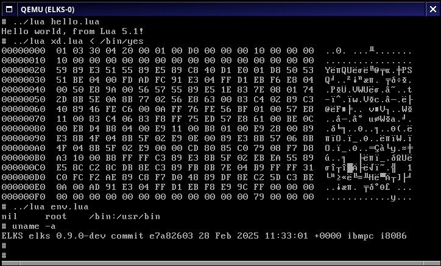

This is a Lua port for ELKS using int32_t as Lua number.
Not all features will behave properly - keep integer-only for
predictable results.

Other branches are:

https://github.com/rafael2k/lua/tree/lua-5.1 - Lua 5.1.5 with minimal patching to run on ELKS
https://github.com/rafael2k/lua/tree/lua-5.1i - Special integer-only Lua 5.1.5 (does not have most mathlib functions)
https://github.com/rafael2k/lua/tree/master - Tracking PUC-Rio upstream Lua (to become Lua 5.5), minimal patching for ELKS port

# README for Lua 5.1

See INSTALL for installation instructions.
See HISTORY for a summary of changes since the last released version.

## What is Lua?

  Lua is a powerful, light-weight programming language designed for extending
  applications. Lua is also frequently used as a general-purpose, stand-alone
  language. Lua is free software.

  For complete information, visit Lua's web site at http://www.lua.org/ .
  For an executive summary, see http://www.lua.org/about.html .

  Lua has been used in many different projects around the world.
  For a short list, see http://www.lua.org/uses.html .

## Availability

  Lua is freely available for both academic and commercial purposes.
  See COPYRIGHT and http://www.lua.org/license.html for details.
  Lua can be downloaded at http://www.lua.org/download.html .

## Installation

  Lua is implemented in pure ANSI C, and compiles unmodified in all known
  platforms that have an ANSI C compiler. In most Unix-like platforms, simply
  do "make" with a suitable target. See INSTALL for detailed instructions.

## Origin

  Lua is developed at Lua.org, a laboratory of the Department of Computer
  Science of PUC-Rio (the Pontifical Catholic University of Rio de Janeiro
  in Brazil).
  For more information about the authors, see http://www.lua.org/authors.html .
